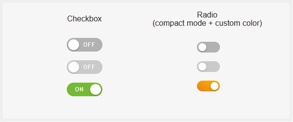

# Superlight pure javascript form switch plugin by LCweb

Give a modern look to your applications and take advantage of javascript events and public functions.<br/>
Vanilla javascript. No dependencies. Everything in a **single 7KB** file, all inclusive!





<br/>

### Top features list:

- sigle 7KB file, no dependencies, 100% ES6 javascript
- minimal integration efforts in existing forms
- public functions to manage each field status
- hook through textual selector or DOM object (yes also jQuery ones)
- complete events tracking
- custom texts support
- optional compact mode
- optional custom active color (supporting gradients)


Tested on all mordern browsers *(don't ask for old IE support please)*<br/>
For live demos check: https://lcweb.it/lc-switch-javascript-plugin

<br/>

## Installation & Usage

1. include lc_switch.min.js

2. initialize plugin targeting one/multiple fields.<br/>**NB:** first parameter may be a textual selector or a DOM object (yes, also jQuery objects)


```
<script type="text/javascript>
lc_switch('input[type=checkbox], input[type=radio]');
</script>
```


<br/>

## Options

Available options with default values


```
<script type="text/javascript>
lc_switch('input[type=checkbox], input[type=radio]', {

    // (string) "checked" status label text
    on_txt      : 'ON',
    
    // (string) "not checked" status label text
    off_txt     : 'OFF',

    // (string) custom "on" color. Supports also gradients
    on_color    : false,

    // (bool) whether to enable compact mode
    compact_mode: false
});
</script>
```


<br/>

## Public Functions

Available public functions to be called on *initialized inputs*


```
<script type="text/javascript>
const inputs = document.querySelectorAll('input[type=checkbox], input[type=radio]');
lc_switch(inputs):


// checks the field
lcs_on(inputs);

// unchecks the field
lcs_off(inputs);

// toggles targeted field
lcs_toggle(inputs);


// disables the field
lcs_disable(inputs);

// enables the field
lcs_enable(inputs);


// refreshes plugin interface retrieving input attributes (useful while changing HTML attributes directly)
lcs_update(inputs);

// destroys plugin initialization showing HTML fields again
lcs_destroy(inputs);
</script>
```


<br/>

## Public Events


```
<script type="text/javascript>
document.querySelectorAll('input[type=checkbox], input[type=radio]').forEach(function(el) {

    // triggered each time input status changes (checked and disabled)
    el.addEventListener('lcs-statuschange', ...);
    
    
    // triggered each time input is checked
    el.addEventListener('lcs-on', ...);
    
    // triggered each time input is uncheked
    el.addEventListener('lcs-off', ...);
    
    
    // triggered each time input is enabled
    el.addEventListener('lcs-enabled', ...);
    
    // triggered each time input is disabled
    el.addEventListener('lcs-disabled', ...);

});
</script>
```


* * *


Copyright &copy; Luca Montanari - [LCweb](https://lcweb.it)
